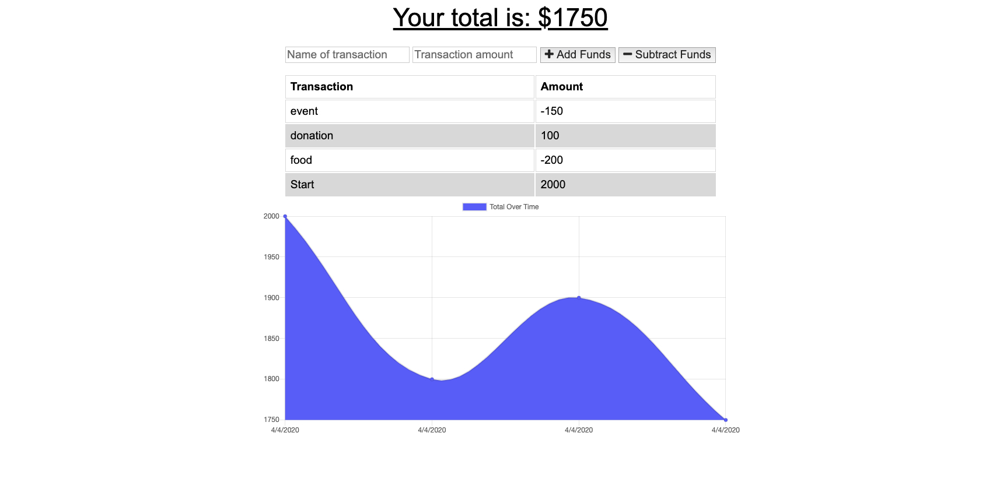

# Project #16: Budget Tracker

An application that allows it's users to track thier budgets both online and offline, if they have connected at least once online.

## Table of Contents

1. [About](#about)
2. [Getting Started](#getting-started)

## About

Budget Tracker is an application that enables users to view, create and track their budgets. If the user has at least connected once, they are able to log their expenses offline.  

Currently the user will not be able to view the offline budgets offline if they reload the page but once connected, the items will be saved in a database for future use.

## Images

Main Page

## Getting Started on your own machine

Clone the application to your local machine:

``
git clone git@github.com:Braydon-Nelson/16-Budget-Tracker.git
``

Prepare the NPM Packages:

``
npm i
``

The application can be with the following command:

``
npm start
``

Start Tracking

## Built With
- [HTML](https://www.w3schools.com/html/)
- [CSS](https://www.w3schools.com/css/)
- [JavaScript](https://www.w3schools.com/javascript/)
- [Bootstrap](https://getbootstrap.com/)
- [Node](https://nodejs.org/)
- [Express - NPM](https://www.npmjs.com/package/express)
- [MongoDB](https://www.mongodb.com/)
- [Mongoose - NPM](https://www.npmjs.com/package/mongoose)
- [morgan - NPM](https://www.npmjs.com/package/morgan)
- [IndexDB](https://developer.mozilla.org/en-US/docs/Web/API/IndexedDB_API)

## Live Application

Link to live application - https://uofu-16-budget-tracker.herokuapp.com/
